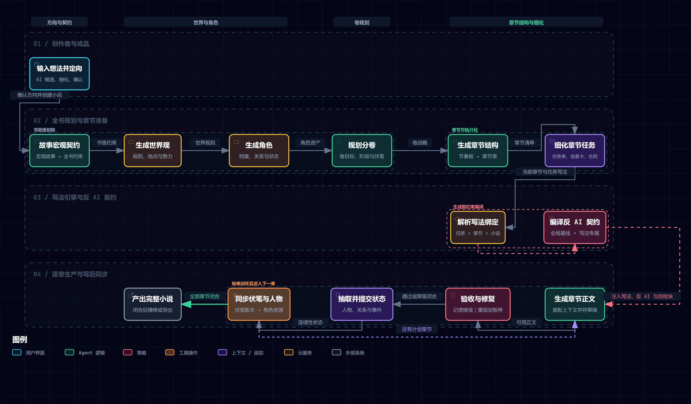

# 自动导演交互架构图

这张图展示从一句想法到完整小说的主要生产链，包括全书契约、世界与角色、卷章规划、写法引擎、反 AI 规则、章节生成、质量处理和写后状态同步。

[打开交互架构图](https://explosivecoderflome.github.io/AI-Novel-Writing-Assistant/architecture/auto-director-idea-to-novel.detailed.workflow.html)

## 图中重点

- 写法绑定按任务、章节、小说三个范围解析，越具体的绑定优先级越高。
- 全局反 AI 基线与写法专属规则会合并成生成契约，再注入正文写作提示。
- 局部质量问题进入修复或质量债，不会自动阻断整本生产；只有明确需要重规划时才暂停。
- 章节闭合后会提交人物、关系与事件状态，并同步伏笔账本和角色资源，供下一章继续使用。

## 生成工具

交互图使用开源项目 [Archify](https://github.com/tt-a1i/archify) 生成。图表源数据与自包含 HTML 保存在仓库的 `docs/architecture/` 目录，文档网站发布时会同步交互 HTML。
