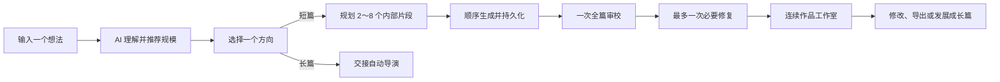

# 创作意图平台与短篇闭环

## 背景

长篇自动导演擅长完成复杂的分阶段生产，但把它直接作为所有创作的入口，会让用户先理解题材、结构、设置和生产阶段，再表达真正想写的内容。短篇又需要更快的完整交付、连续阅读和低成本修改，不能简单缩短长篇章节链。

创作工作室因此承担“用户想法到正式生产链”的桥接职责：用户先表达想法，AI 解释并推荐作品规模，用户只确认方向，后台再选择短篇生产链或现有长篇自动导演。

## 决策

- `NarrativeForm` 表示作品形态：`short_story` 或 `long_novel`。
- `creationExperience` 只控制现有长篇的简易/专业体验，不参与短篇路由。
- `creation_studio` 是独立 workflow lane。lane 的展示、恢复与能力通过描述注册表维护，不继续扩展针对 `auto_director` 的二元判断。
- AI 通过结构化 Prompt 合同解释意图、推荐形态与目标字数、生成差异方向。确定性代码只校验数量、范围和结构，不通过关键词或正则判断作品规模或题材。
- 短篇使用独立正式生产链；长篇确认后交接现有自动导演，不复制长篇生产能力。

## 当前工作流

用户采用推荐值时，从想法到开始生产只有“提交想法、确认方向”两个必需动作。短篇入口默认提供 4 个方向，可在提交前选择 2、4 或 6 个；长篇保持 2 个。方向要围绕原始想法呈现不同的题材体验、冲突推进或结尾兑现，不能只改标题。用户调整作品形态或字数后，AI 必须重新适配方向，避免用原方向硬套新的规模。

确认前可以仅重做一个短篇方向。用户反馈是可选的自然语言约束，AI 接收原始想法、当前方向和其余候选后返回一个完整替代方向；其他候选的内容与顺序保持稳定。新结果以新的意图版本保存，失败不覆盖旧版本；整组更新失败且旧版本仍有效时，恢复到旧方向的待确认状态。重做中的候选不能确认，已选候选若被替换则须重新选择；单项重做与确认请求都携带所见意图版本，整组更新、单项重做和确认在写入时争用同一个任务版本条件，避免多页面或多进程交错确认更新后的同 ID 方向。确认认领后不能再改写候选，失败的确认只用原意图和原幂等键重试。短篇的题材与推进模式在确认时依据最终选中的方向确定，不能沿用第一张候选的创作底座。

首页和小说列表把“自动导演写长篇”与“创作短篇”作为并列入口。短篇入口显式传入 `short_story` 偏好，让 AI 围绕短篇规模整理方向；自动导演入口仍进入原有长篇开书流程。入口继续受创作工作室功能开关控制，可在预发布验收期间整体关闭短篇入口。

创作工作室初始状态使用编辑式创作画布，不使用多层表单卡片或无功能装饰。首屏只突出想法输入与“生成创作方向”，字符计数按需出现，完整设置保持为次要入口。

## 意图版本合同

- `NovelIntentVersion.originalExpression` 保存用户原始表达。
- `structuredIntentJson` 保存 AI 的完整结构化理解。
- `impactScopeJson` 保存方向选择或修改影响范围。
- 同一作品只有一个生效意图版本；自然语言修改先创建待确认版本，用户确认后才切换生效状态。
- 确认创作方向使用稳定幂等键和 `CreationStudioConfirmation`。重复请求复用同一作品与生产任务，不能创建第二条链。

## 短篇生产规则

- 首期目标字数为 3,000～30,000 字，AI 决定 2～8 个内部片段。
- 产品中的“短篇”默认指篇幅更短、一次读完且完整收束的中文网络小说，不是散文、纯文学小品、故事梗概或影视分场。题材可以克制或细腻，但必须保持网文的即时钩子、主动目标、持续推进、题材回报和明确结局。
- 新计划使用 schemaVersion 2。每个内部片段除起止状态外，还必须提供开篇钩子、即时目标、2～6 个因果推进节拍、题材回报和结尾牵引，避免正文生成只收到抽象的“片段目的”。
- 正文按手机阅读节奏组织，以具体场景、动作、选择和自然对话推进。第一片段前 300～500 字进入压力、异常、冲突或决定点；不能用长段景物、梦境、身世说明或世界设定慢热开场。
- 网文回报按题材选择，可以是破局、反击、真相、身份变化、关系兑现或情绪释放，不把所有作品机械写成打脸爽文。
- 片段是后台恢复游标，不是面向读者的章节。前端和导出只呈现连续正文。
- 生成顺序固定为计划、逐段写作、全篇审校、最多一次修复。
- 已完成片段直接复用；失败从当前片段继续。异常退出留下的 `generating` 状态只有超过租期后才能回收，防止并发重复写入。
- 普通质量问题作为质量债完成交付。只有明确要求重规划、没有可用正文、运行时安全或数据完整性问题才停止任务。
- 全篇审校必须检查钩子、主角行动、场景推进、反转与回报、段落可读性和结局兑现；空泛抒情、梗概化、超长密集段落或碎句滥用属于可修复问题，不应被误判为高级文风。

## 编辑与修改保护

- 直接编辑按内部片段保存，使用 `expectedVersion` 做乐观并发校验。
- 每次人工保存或确认 AI 重写前先建立正文快照。
- 自动修复和失败恢复不能覆盖带有人工编辑标记的片段。
- 自然语言修改先展示 AI 理解、影响片段、是否改变结尾/规模/核心意图，以及局部修复、下游重写或全篇重规划建议。
- 所有涉及已完成正文的 AI 重写都必须由用户显式确认。

## 恢复与路由

- 方向确认前恢复到 `/create?taskId=...`。
- 短篇创建后恢复到 `/novels/:id/story`。
- 长篇任务继续使用自动导演恢复入口。
- 服务启动时恢复排队中或运行中的短篇任务；失败任务可从作品页显式继续。
- 显式 `replan_required` 不得被普通重试清除，必须先让用户确认新的创作方向。

## 短篇发展成长篇

“发展成长篇”创建新的创作任务，继承短篇的有效意图、核心人物、冲突、结尾承诺和成稿摘要。用户重新确认长篇方向后创建新的 `long_novel`，并交接自动导演。原短篇保持不变，新长篇通过 `derivedFromNovelId` 记录来源。

## Creative Hub 边界

Creative Hub 可以理解“把这个想法写成短篇”等目标，并引导或发起创作工作室任务；它不能在聊天请求中直接执行短篇计划、分段写作、全篇审校、修复或正文重写。这些重型动作必须进入正式 workflow、Prompt Registry 和任务投影。

## 失败模式

- 重试确认后出现两部作品：检查客户端是否复用稳定幂等键，以及确认记录唯一约束是否生效。
- 重做一个方向却改变其他候选，或刷新后回到旧方向：检查新意图版本是否只替换目标 ID、任务是否指向新版本，以及失败时是否错误地 supersede 旧版本。
- 短篇方向选了不同题材却落到第一张卡的题材：检查确认阶段是否按最终选中的方向解析创作底座。
- 刷新后从头重写：检查计划和片段是否持久化、已完成片段是否被当成 pending。
- 人工正文被覆盖：检查 `userEditedAt`、快照和写入条件是否同时生效。
- 普通审校问题阻断整篇：检查是否错误映射成 `replan_required` 或失败任务。
- 短篇导出出现片段标题：检查导出是否使用连续正文，而不是复用长篇章节格式。
- Creative Hub 能写短篇但任务中心无记录：说明绕过了正式工作流，必须收回到创作工作室。

## 相关模块

- `server/src/modules/novel/creation-studio/`
- `server/src/modules/novel/short-story/`
- `server/src/prompting/prompts/creation/`
- `server/src/prompting/prompts/shortStory/`
- `server/src/services/novel/workflow/`
- `client/src/pages/creationStudio/`
- `client/src/pages/shortStory/`

## 来源文档

- [Creative Hub 边界](creative-hub-boundary.md)
- [新手优先与整本小说完成原则](../product/beginner-first-novel-completion.md)
